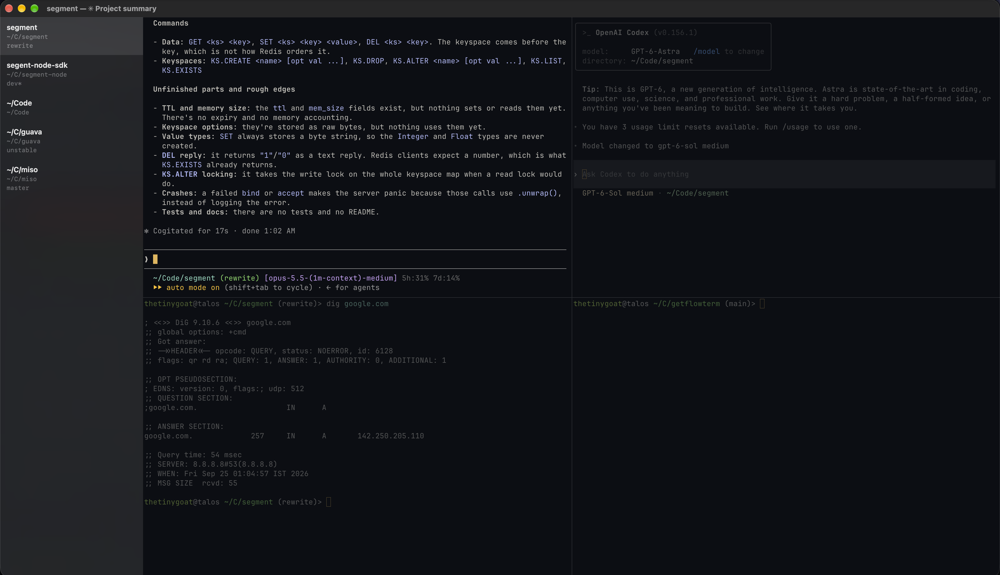

<p align="center">
  
</p>

<h1 align="center">Flow</h1>

<p align="center">A calmer, more productive terminal.</p>

<p align="center">
  <a href="https://github.com/thetinygoat/flow/releases/latest">Download</a>
  ·
  <a href="https://getflowterm.app/docs/getting-started/">Docs</a>
  ·
  <a href="https://getflowterm.app/changelog/">Changelog</a>
</p>

A fast, native terminal built on Ghostty, for everyday work. Run a fleet of agents or just a shell. Flow stays deliberately minimal and simple, with no accounts and no telemetry.



## Why Flow?

**Native and fast.** Flow is a Swift and AppKit app powered by libghostty. There is no Electron and no web view.

**Made for agents.** Flow shows what Claude Code, Codex and OpenCode are doing in each workspace, and tells you when one finishes or needs you. See [Agents](#agents).

**Private and simple.** No account, no telemetry, no tracking. Your terminal is yours.

## Install

Flow needs macOS 14 or later.

1. Download the latest `.dmg` from [releases](https://github.com/thetinygoat/flow/releases/latest).
2. Open it and drag Flow into Applications.
3. Open Flow.

Flow updates itself.

## Getting around

Each project gets its own workspace in the sidebar, with its own tabs and split panes. Flow reopens everything as you left it.

Drag workspaces up or down in the sidebar to reorder them. Flow remembers their order when you reopen it.

| Shortcut                              | Action           |
| ------------------------------------- | ---------------- |
| <kbd>⌘</kbd><kbd>N</kbd>              | New workspace    |
| <kbd>⌘</kbd><kbd>T</kbd>              | New tab          |
| <kbd>⌘</kbd><kbd>D</kbd>              | Split right      |
| <kbd>⌘</kbd><kbd>1</kbd>–<kbd>9</kbd> | Switch workspace |

Hold <kbd>⌘</kbd> to see the shortcut for each workspace. The [docs](https://getflowterm.app/docs/keyboard-shortcuts/) list the rest.

## Agents

Run `claude`, `codex` or `opencode` in a Flow terminal and the workspace shows what it is doing:

| Dot            | Meaning                                              |
| -------------- | ---------------------------------------------------- |
| Blue, pulsing  | The agent is working                                 |
| Yellow         | The agent is waiting for you                         |
| Green          | A turn finished while you were looking elsewhere     |

Looking at the terminal clears the green dot. A terminal you are not looking at also gets a macOS notification, which focuses it when clicked, and a sound: one when an agent needs you, another when it finishes.

Flow does this through the agents' own hooks and plugins, added to each launch and nothing else. It never writes to `~/.claude`, `~/.codex` or `~/.config/opencode`, and an agent started outside Flow behaves exactly as before. There is nothing to set up for fish and zsh. Two things need a step from you:

**Bash.** Flow cannot add itself to bash. Put this at the end of `~/.bashrc` or `~/.bash_profile`:

```bash
[ -n "$FLOW_FLW" ] && source "${FLOW_FLW%/*}/../Resources/shell-integration/bash/flow.bash"
```

**Codex.** Codex runs a hook only after you have reviewed it. The first time you start `codex` in Flow, run `/hooks` inside it and trust the Flow hooks. Codex remembers your answer, and asks again only if Flow moves to a different location.

To run an agent without Flow's hooks for one session, start it with `FLOW_AGENTS_DISABLED=1`.

## Configuration

Flow has no config file of its own. It reads your Ghostty config, so your fonts, themes and keybindings carry over. Choose **Flow › Settings…** to open it.

Flow aims to support every Ghostty setting, but some don't work in Flow yet. If a setting you rely on has no effect, [open an issue](https://github.com/thetinygoat/flow/issues/new).

## Build from source

You need Xcode 27, Zig 0.15.2 and xcodegen (`brew install zig@0.15 xcodegen`). Use Homebrew's Zig: the upstream 0.15.2 build can't link against the Xcode 26.4 and later SDKs.

```sh
git clone --recursive https://github.com/thetinygoat/flow.git && cd flow
./scripts/build-ghosttykit.sh   # builds libghostty, slow, only needed once
xcodegen generate               # writes flow.xcodeproj from project.yml
open flow.xcodeproj
```

To build without opening Xcode, run `xcodebuild -scheme flow -configuration Debug build`.

`Vendor/ghostty` is a git submodule pinned to Ghostty's latest stable release. `patches/` holds build fixes for Xcode 27 that landed upstream after that release, and the build script applies them.

### Tests

```sh
xcodebuild test -scheme flow -destination 'platform=macOS'
```

The tests compile the model sources directly and don't launch the app.

### Layout

| Directory            | Contents                                                                                         |
| -------------------- | ------------------------------------------------------------------------------------------------ |
| `Sources/Ghostty/`   | The wrapper around libghostty's C API, with the runtime, config, input and terminal view         |
| `Sources/Workspace/` | The workspace, tab and pane model. It's generic over `PaneLeaf`, so tests run without terminals. |
| `Sources/UI/`        | The AppKit window, with the sidebar on the left and terminals on the right                       |
| `Tests/`             | Unit tests for the model                                                                         |

`Vendor/GhosttyKit.xcframework` and `Vendor/GhosttyResources` are build outputs and aren't committed.

## License

Flow is released under the [MIT License](LICENSE). Third-party licenses are in [THIRD_PARTY_LICENSES.md](THIRD_PARTY_LICENSES.md).
